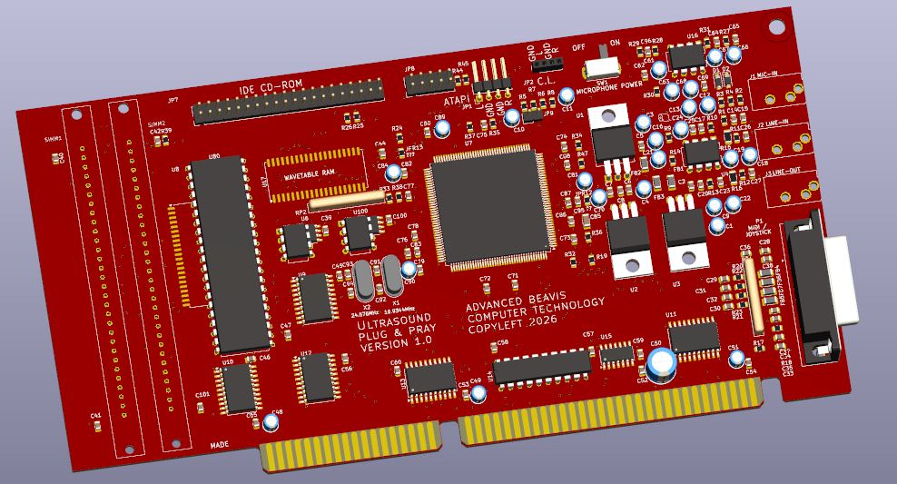

# Beavis Ultrasound PnP ISA Sound Card Replica

```
Uhhh... I'm, like, angry at numbers.
Yeah, there's like, too many of them and stuff.
```

The Beavis Ultrasound PnP is an open source replica of the Gravis Ultrasound
Pnp. Unlike other clones, this design includes the entire schematic as well
as the reverse-engineered source code of the GAL.



If you want to build this board, first make sure you have an AMD InterWave
chip, the AM78C201. The design of the card is quite simple since essentially
all sound card functionality is built into the AMD chip.

*Note: I have not generated the fab package since I have not actually
fabricated the board and tested it for functionality. Build this board at your
own risk.*

[Schematic PDF](BeavisUltrasoundPnp.pdf)

## Fab Notes

The board is 8.2 x 4.2 inches (208 x 107mm) and 4 layers. Feel free to go with
ENIG plating for the edge fingers; although hard gold is technically better, it
is ludicrously expensive.

## Assembly Notes

The dual op amps may be substituted. The BOM calls out the LM833 but the
JRC5532 will also work. Basically, any ~10MHz low noise op amp that can handle
a +/-8V input power supply will suffice.
If you want to get fancy, install sockets and experiment.

The ferrite beads were missing from the card I started with so their values
are unknown but you can replace them with a 0 ohm resistor or a piece of wire.
It's a little odd using ferrite beads to filter the voltage regulators when
they are really only effective at frequencies far higher than the audio range.

JPR12 and JPR13 are not installed. Presumably these were for testing the
isolation of the 5V analog power planes, which have cuts to reduce crosstalk
between the analog and digital supplies of the InterWave chip.

U100 is there for completeness but in practice is never used since it hosts
a PLL chip that doesn't seem to exist anymore. Use the two crystals instead.

## Programmable Devices

U8, the IW78C21M1, is the 1MB sample ROM. If you can't find this chip, then
go find and download the sample ROM from around the internet and burn it to
a 27C800, and install it (preferably socketed) at U80.

U6/U60 is the 93C66 EEPROM containing the plug-n-play configuration data.
You should program it with the contents of [ultrasound\_pnp.bin](ultrasound_pnp.bin) using a TL866 or equivalent device programmer.
Note that the order of bits is reversed in the EEPROM contents, 16 bits at
a time. For example, the first two bytes are actually `1E 56` but are stored
as `6A 78`. A small Python program, `pnp_reverse.py`, is provided if you are
curious, but it is not necessary to program the 93C66. It's only useful if
you want to experiment with custom configurations and you're not using the
`PNPMAP.EXE` utility provided by Gravis/AMD.

U14 is a GAL used for several purposes:

* Buffer IOCS16 from the IDE port to the ISA bus
* Buffer the bus reset signal to the IDE port
* Decode some address lines to make the primary/secondary drive select signals
* Control the buffer enable signals for the ISA to IDE data buffers

If you don't need the CDROM IDE function, you probably don't need the GAL. If
you do, burn the [gr\_gal.jed](gr_gal.jed) file into a 16V8. You can also build it from the `GR_GAL.PL2` file if you want.


